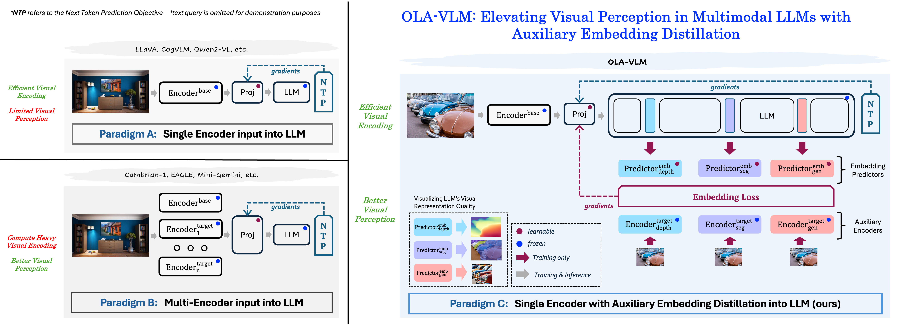

# VisPer-LM (f.k.a. OLA-VLM)

[](https://pytorch.org/) [](https://huggingface.co/spaces/shi-labs/VisPer-LM) [](https://youtu.be/bY6BN9cNCHg)

[Jitesh Jain<sup>*</sup>](https://praeclarumjj3.github.io/), [Zhengyuan Yang](https://zyang-ur.github.io/), [Humphrey Shi<sup>&dagger;</sup>](https://www.humphreyshi.com/home), [Jianfeng Gao<sup>&dagger;</sup>](https://scholar.google.com/citations?user=CQ1cqKkAAAAJ), [Jianwei Yang<sup>&dagger;</sup>](https://jwyang.github.io/)


<sup>*</sup>Work done during an internship at Microsoft Research, Redmond &nbsp;&nbsp; <sup>&dagger;</sup>Equal Advising

[[`Project Page`](https://praeclarumjj3.github.io/visper_lm/)] | [[`arXiv`](https://arxiv.org/abs/2412.09585)] [[`Model Checkpoints`](https://huggingface.co/models?search=OLA-VLM)] [[`Video`](https://drive.google.com/file/d/1nESAo9SiMt8uTH7GC3sAJIg8qohBC2-t/view?usp=drive_link)] [[`BibTeX`](#citation)]

This repo contains the code for our paper **Elevating Visual Perception in Multimodal LLMs with Visual Embedding Distillation**.

<p align="center">
    
</p>

We propose **distilling target visual information into the intermediate representations of the LLM from a set of target encoders**. We adopt a predictive embedding optimization approach at selected LLM layers during training to minimize the embedding losses along with the next token prediction (NTP) objective, resulting in a vision-centric approach to training the Multimodal Large Language Model.

## Contents

1. [Installation Instructions](#installation-instructions)
2. [Demo](#demo)
3. [Getting Started](#getting-started)
4. [Results](#results)
5. [Citation](#citation)

## News

- **[September 21, 2025]**: VisPer-LM is accepted to NeurIPS 2025! 🥂
- **[December 14, 2024]**: Our demo is now available on [HuggingFace Spaces](https://huggingface.co/spaces/shi-labs/VisPer-LM). Thanks to the HF team for their support with the ZeroGPU grant! 🤗
- **[December 12, 2024]**: 🚀 [**Project Page**](https://praeclarumjj3.github.io/ola-vlm/), [**ArXiv Preprint**](https://arxiv.org/abs/2412.09585) and [**GitHub Repo**](https://github.com/SHI-Labs/VisPer-LM) are public! We also open-source the [model checkpoints](https://huggingface.co/models?search=OLA-VLM) and [probes](https://huggingface.co/models?search=shi-labs/probe) on huggingface hub! 🎁

## Installation Instructions

>Note: We trained all our models on AMD MI300x GPUs. However, in this repo, we provide instructions for Nvidia GPUs considering their wider usage.

- Clone this repository.

    ```bash
    git lfs install
    git clone https://github.com/SHI-Labs/VisPer-LM
    cd VisPer-LM
    ```

- Setup conda environment with the base dependencies.

    ```bash
    conda create -n visper_lm -y
    conda activate visper_lm
    pip install -e .
    pip install flash-attn --no-build-isolation
    pip install scikit-learn icecream datasets pytorch-fid lpips opencv-python-headless
    pip install setuptools==61.0.0
    pip install -e lmms-eval/
    pip install huggingface_hub==0.24.7
    pip install transformers==4.41.1
    ```

## Demo

[](https://huggingface.co/spaces/shi-labs/VisPer-LM)

You can use the Gradio interface to interact with VisPer-LM locally. The demo also supports visualizing the respresentations from the slected intermediate LLM layers (embedding loss positions).

```bash
# install demo-specific libraries
pip install -e .["demo"]

# start the demo
CUDA_VISIBLE_DEVICES=0 python demo.py --model-path shi-labs/pretrain_dsg_OLA-VLM-CLIP-ViT-Llama3-8b --PT-model-path shi-labs/pretrain_dsg_OLA-VLM-CLIP-ViT-Llama3-8b
```

## Getting Started

>Note: We provide the guide to integrating the embeddding losses from VisPer-LM into any custom MLLM in [Custom_MLLM.md](docs/Custom_MLLM.md)

### Training

- Please see [Training.md](docs/Training.md) for training commands and dataset preparation.
- We train all our models using 16 192G [MI300X AMD](https://www.amd.com/en/products/accelerators/instinct/mi300/mi300x.html) GPUs.

### Evaluation

Please see [Evaluation.md](docs/Evaluation.md) for evaluation commands 

### Probing

Please see [Probing.md](docs/Probing.md) for probing commands.

## Results

| **Method** | **Training Stages** | **LLM** | **Base Encoder** | **CV-Bench** | **MMStar** | **RWQA** | **OK-VQA** | **Checkpoint** |
|:-----:|:-----:|:-----:|:-----:|:-----:|:-----:|:-----:|:-----:|:-----:|
| VisPer-LM | PT + IFT | Phi3-4k-mini | CLIP-ViT-L         | 62.5 | 36.0 | 58.0 | 56.4  | [ckpt](https://huggingface.co/shi-labs/OLA-VLM-CLIP-ViT-Phi3-4k-mini) |
| VisPer-LM | PT + IFT | Phi3-4k-mini | CLIP-ConvNeXT-XXL  | 63.9 | 38.4 | 58.4 | 56.5  | [ckpt](https://huggingface.co/shi-labs/OLA-VLM-CLIP-ConvNeXT-Pgi3-4k-mini) |
| VisPer-LM | PT + IFT | Llama3-8b    | CLIP-ViT-L         | 61.4 | 39.5 | 57.9 | 56.6  | [ckpt](https://huggingface.co/shi-labs/OLA-VLM-CLIP-ViT-Llama3-8b) |
| VisPer-LM | PT + IFT | Llama3-8b    | CLIP-ConvNeXT-XXL  | 61.5 | 38.5 | 55.0 | 59.0  | [ckpt](https://huggingface.co/shi-labs/OLA-VLM-CLIP-ConvNeXT-Llama3-8b) |
| VisPer-LM | PT + VPT + IFT | Llama3-8b    | CLIP-ConvNeXT-XXL  | **64.6** | **40.6** | **62.9** | **61.1**  | [ckpt](https://huggingface.co/shi-labs/vpt_OLA-VLM-CLIP-ConvNeXT-Llama3-8b) |


## Citation

If you found VisPer-LM useful in your research, please consider starring ⭐ us on GitHub and citing 📚 us in your research!

```bibtex
@inproceedings{jain2025visper_lm,
      title={{Elevating Visual Perception in Multimodal LLMs with Visual Embedding Distillation}},
      author={Jitesh Jain and Zhengyuan Yang and Humphrey Shi and Jianfeng Gao and Jianwei Yang},
      booktitle={NeurIPS},
      year={2025}
}
```

## Acknowledgement

We thank the authors of [LLaVA-1.5](https://github.com/haotian-liu/LLaVA), [OneFormer](https://github.com/SHI-Labs/OneFormer), [Depth-Anything v2](https://github.com/DepthAnything/Depth-Anything-V2), and [unCLIP-SD](https://huggingface.co/stabilityai/stable-diffusion-2-1-unclip/tree/main) for open-sourcing their codebase and checkpoints. We are grateful to the authors of [cambrian](https://github.com/cambrian-mllm/cambrian) and [MMStar](https://github.com/MMStar-Benchmark/MMStar) for releasing their code for CV-Bench and MMStar evaluation, respectively.
