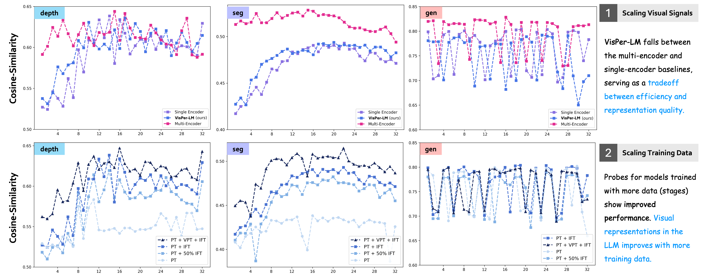

# Probing

We analyze the visual representation quality inside the LLM (of the MLLM) through a series of probing experiments against target representations from encoders from the [OneFormer](https://github.com/SHI-Labs/OneFormer), [Depth-Anything v2](https://github.com/DepthAnything/Depth-Anything-V2), and [unCLIP-SD](https://huggingface.co/stabilityai/stable-diffusion-2-1-unclip/tree/main) models for the seg, depth, and gen features, respectively.

<p align="center">
    
</p>

Specifically, we add a single layer Perceiver Resampler based probes at every LLM layer and train the probes for 2 epochs on the COCO-train2017 set with the smooth-L1-loss objective.

## Training the Probes

>Note: We trained our probes on 16 MI300X GPUs with the total batch size of 256 per iteration. 

```bash
# download annotations and images
cd datasets
mkdir -p coco && wget http://images.cocodataset.org/annotations/annotations_trainval2017.zip && unzip annotations_trainval2017.zip && wget http://images.cocodataset.org/zips/train2017.zip && unzip train.zip && wget http://images.cocodataset.org/zips/val2017.zip && unzip val2017.zip && cd ..

# depth probing
bash scripts/probe/probe.sh depth

# seg probing
bash scripts/probe/probe.sh seg

# gen probing
bash scripts/probe/probe.sh gen
```

## Evaluating the Probes

>You can find the probe checkpoints from our paper on the HF Hub: [`[depth probes]`](https://huggingface.co/models?sort=trending&search=shi-labs/probe_depth) | [`[seg probes]`](https://huggingface.co/models?sort=trending&search=shi-labs/probe_seg) | [`[gen probes]`](https://huggingface.co/models?sort=trending&search=shi-labs/probe_gen).

### Feature Cosine-Similarity

Evaluate the cosine-similarity of the probes from every LLM layer against the corresponding target representations on the COCO-val2017 images.

```bash
bash scripts/probe/eval_probe_cos_sim.sh shi-labs/OLA-VLM-CLIP-ConvNeXT-Llama3-8b depth
```

### Target Probe Task

Evaluate the probes on the target probe task (segmentation/depth estimation/image generation) on the corresponding task-specific benchmarks.

#### Depth Estimation

We evaluate the accuracy on the [DA-2K](https://huggingface.co/datasets/depth-anything/DA-2K) benchmark.

```bash
# download DA-2K benchmark
git lfs install
cd datasets/eval/ && wget https://huggingface.co/datasets/depth-anything/DA-2K/resolve/main/DA-2K.zip && unzip DA-2K.zip && cd ../../

# evaluate
CUDA_VISIBLE_DEVICES=0,1,2,3 bash scripts/probe/eval_probe_task.sh shi-labs/probe_depth_llava-1.5-pt-ift depth
```

#### Semantic Segmentation

We evaluate the mIoU on the COCO-val2017 set.

```bash
# prepare annotations
cd datasets/coco/annotations && wget http://images.cocodataset.org/annotations/panoptic_annotations_trainval2017.zip && unzip panoptic_annotations_trainval2017.zip && cd ../../..
python ola_vlm/eval/convert_pan_to_sem.py

# evaluate
CUDA_VISIBLE_DEVICES=0,1,2,3 bash scripts/probe/eval_probe_task.sh shi-labs/probe_seg_llava-1.5-pt-ift seg
```

#### Image Generation

We evaluate the FID on the COCO-val2017 set.

```bash
# evaluate
CUDA_VISIBLE_DEVICES=0,1,2,3 bash scripts/probe/eval_probe_task.sh shi-labs/probe_gen_llava-1.5-pt-ift gen
```
