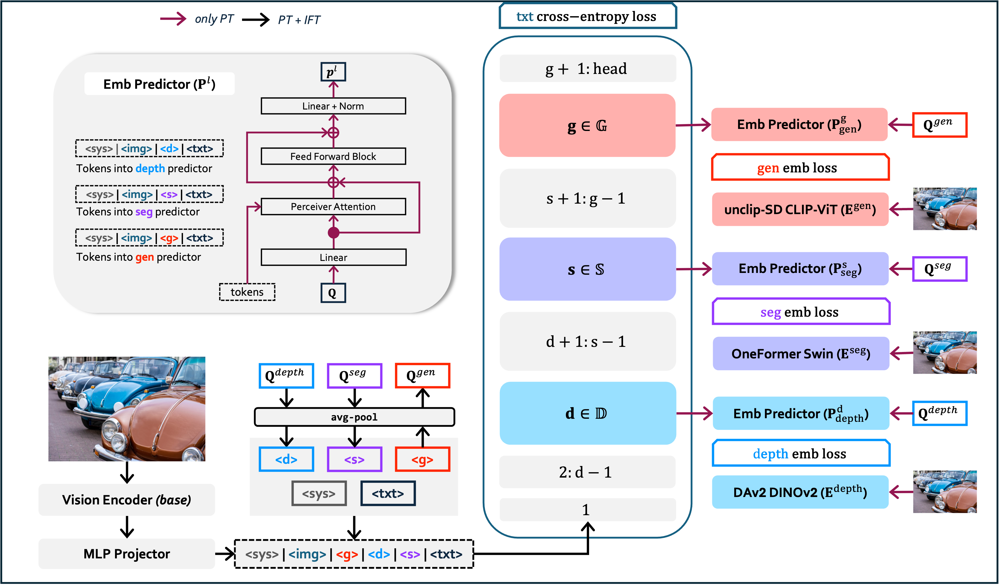

# Training OLA-VLM

By default, we train our OLA-VLM models using two stages:

- **Pre-Training (PT)** with the next-token prediction objective and embedding losses. We set the parameters belonging to the MLP Projector, embedding predictors, and the special task tokens as learnable during the PT stage.
- **Instruction Fine-tuning (IFT)** with only the next-token prediction objective with the MLP Projector and the LLM parameters set as learnable.

<p align="center">
    
</p>

## Pre-Training (PT) Stage

### Dataset Preparation

We use the LLaVA-558K dataset during the PT stage.

```bash
cd datasets
git lfs install
git clone https://huggingface.co/datasets/liuhaotian/LLaVA-Pretrain
cd LLaVA-Pretrain && unzip images.zip & cd ../..
```

### Training

- We train for one epoch with a total batch size of 256 per iteration.
- You can change the base LLM/encoder in [scripts/train/pretrain.sh](../scripts/train/pretrain.sh)

## Instruction Fine-Tuning (IFT) Stage

### Dataset Preparation

We use the [LLaVA-665K](https://github.com/haotian-liu/LLaVA#visual-instruction-tuning) dataset during the IFT stage.

```bash
cd datasets
wget https://huggingface.co/datasets/liuhaotian/LLaVA-Instruct-150K/resolve/main/llava_v1_5_mix665k.json

# COCO
mkdir coco && cd coco && wget http://images.cocodataset.org/zips/train2017.zip && unzip train.zip && cd ..

# GQA
mkdir gqa && cd gqa && wget https://downloads.cs.stanford.edu/nlp/data/gqa/images.zip && unzip images.zip && cd ..

# OCR-VQA
cd ocr_vqa && python loadDataset.py && cd ..

# TextVQA
mkdir text_vqa && cd text_vqa && wget https://dl.fbaipublicfiles.com/textvqa/images/train_val_images.zip && unzip train_val_images.zip && cd ..

# VG
mkdir vg && cd vg && wget https://cs.stanford.edu/people/rak248/VG_100K_2/images.zip && wget https://cs.stanford.edu/people/rak248/VG_100K_2/images2.zip && unzip images.zip && unzip images2.zip && cd ..
```

### Training

- We train for one epoch with a total batch size of 128 per iteration.
- You can change the base LLM/encoder in [scripts/train/finetune.sh](../scripts/train/finetune.sh)

```bash
bash scripts/train/finetune.sh
```

## Visual Pre-Training (VPT) Stage

We train the whole model with the next-token prediction objective on the ALLaVA-Caption data after the PT stage and before the IFT stage, and we term this stage Visual Pre-Training.

### Dataset Preparation

Follow the instructions given [here](https://huggingface.co/datasets/FreedomIntelligence/ALLaVA-4V#data-preparation) and put the ALLaVA-Caption data under the `datasets` directory.

### Training

- We train for one epoch with a total batch size of 128 per iteration.
- You can change the base LLM/encoder in [scripts/train/vpt.sh](../scripts/train/vpt.sh) and [scripts/train/vpt_ift.sh](../scripts/train/vpt_ift.sh).

```bash
# VPT Stage
bash scripts/train/vpt.sh
# IFT Stage
bash scripts/train/vpt_ift.sh
```
